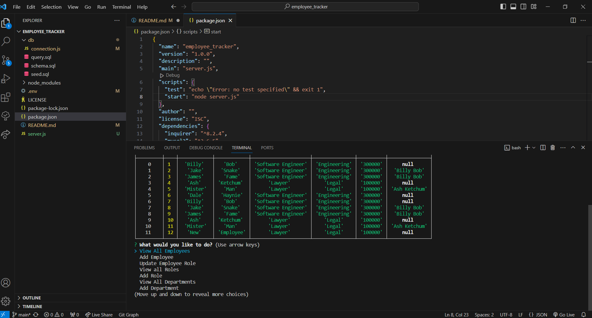

# Employee Tracker App

This command-line application allows users to manage employee data within a company database. It offers functionalities such as viewing all employees, adding/updating employee roles, managing roles, and handling departments.

## Table of Contents

- [How to Use](#how-to-use)
- [Database Setup](#database-setup)
- [Run the Application](#run-the-application)
- [Functionality](#functionality)
- [GitHub Repository](#github-repository)

## How to Use

- **Install Dependencies:**
  Before using the application, ensure you have the necessary dependencies installed. Run `npm install` to install the required packages listed in the `package.json` file.

- **Database Setup:**
  Set up your MySQL database. Modify the `connection` configuration in `connection.js`, `server.js`, and the `.env` with your database details.

- **Run the Application:**
  Execute the application by running `node index.js` in the terminal.

## Functionality

- **View All Employees:**
  Displays a table showing all employees.
  
- **Add Employee:**
  Allows you to add a new employee to the database.
  
- **Update Employee Role:**
  Updates the role of an existing employee.
  
- **View All Roles:**
  Shows a table listing all available roles.
  
- **Add Role:**
  Enables you to add a new role to the database.
  
- **View All Departments:**
  Displays a table listing all departments.
  
- **Add Department:**
  Adds a new department to the database.
  
- **Quit:**
  Exits the application.

## GitHub Repository

Find the complete code for this Employee Tracker app on [GitHub](https://github.com/Daleray1231/employee_tracker).

For helpful instructions on running this application: [Video Tutorial](https://share.vidyard.com/watch/32WC6Q8vSRUSfe2kkahRyP?)

## Technologies Used

- Node.js
- MySQL
- Inquirer.js
- JavaScript

